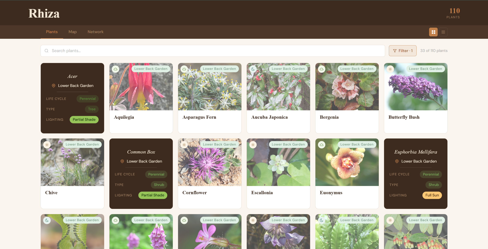
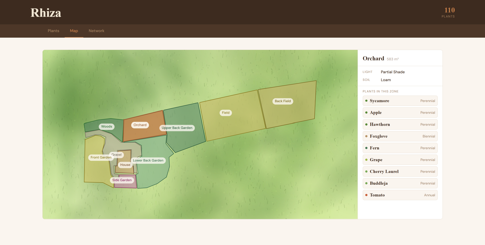
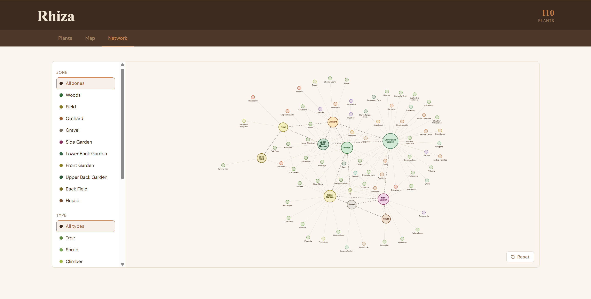

# Rhiza
Catalogue and map for my parent's garden.

 

  

  <em>Rhiza Catalogue preview</em>

 

  

  <em>Rhiza Map preview</em>

 

  

  <em>Rhiza Network preview</em>

## Overview

Growing up in this garden I never really registered how good a job my parents did with it. This project was a completely overkill way to understand the garden deeper so I could appreciate the work and thought (or often lack thereof) that went into it and also give them something they could hopefully use too.  